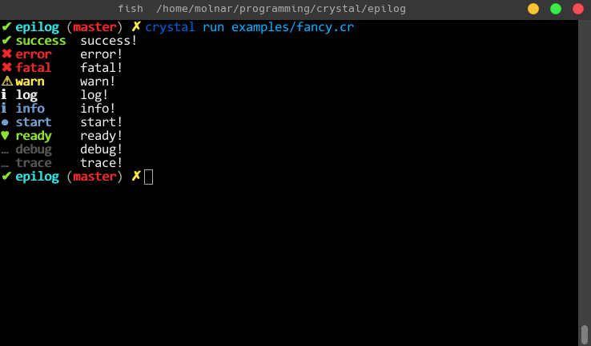

# Epilog

[](https://github.com/ellerbrock/open-source-badge/)
[](https://github.com/ellerbrock/open-source-badge/)
[](http://makeapullrequest.com)

> Elegant, fancy console logger for Crystal

Epilog is heavily inspired by Nuxt's [consola](https://github.com/nuxt/consola).
The API is basically the same.

<div align="center">
  <br>
    
  <br>
</div>

## Installation

Add this to your application's `shard.yml`:

```yaml
dependencies:
  epilog:
    github: crystalrealm/epilog
```

## Usage

```crystal
require "epilog"

# The default reporter is the fancy one. However, if you specify anything else, you get the minimal one.
logger = Epilog::Logger.new "minimal"
# or, logger = Epilog::Logger.new

logger.success "success!"
logger.error "error!"
logger.fatal "fatal!"
logger.warn "warn!"
logger.log "log!"
logger.info "info!"
logger.start "start!"
logger.ready "ready!"
logger.debug "debug!"
logger.trace "trace!"
```

## API

`Epilog` exposes 10 methods to use.

- success
- error
- fatal
- warn
- log
- info
- start
- ready
- debug
- trace

## Contributing

1.  Fork it (<https://github.com/crystalrealm/epilog/fork>)
2.  Create your feature branch (`git checkout -b my-new-feature`)
3.  Commit your changes (`git commit -am 'Add some feature'`)
4.  Push to the branch (`git push origin my-new-feature`)
5.  Create a new Pull Request

## Contributors

- [molnarmark](https://github.com/molnarmark) Mark Molnar - creator, maintainer
